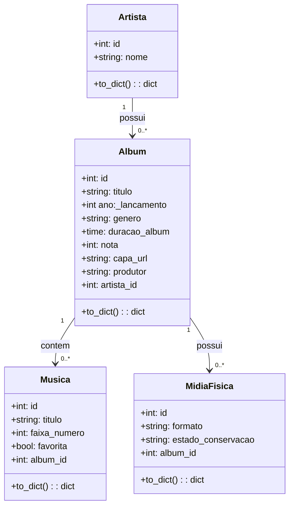

# 🎵 Acervo33 - Sistema de Gestão de Acervo Musical

O **Acervo33** é uma aplicação web desenvolvida para catalogação e gerenciamento de acervos musicais físicos e digitais. O projeto foi estruturado para atender aos requisitos acadêmicos de três disciplinas principais: **Banco de Dados**, **Programação Orientada a Objetos (POO)** e **Design de Interface (UI/UX)**.

---

## 🛠️ Tecnologias Utilizadas

### **Banco de Dados**
* **MySQL (Engine InnoDB):** SGBD relacional para armazenamento persistente em **3FN**.

### **Backend (POO)**
* **Python 3:** Linguagem base da aplicação.
* **Flask:** Microframework web para exposição de rotas API REST.
* **Flask-SQLAlchemy:** ORM para mapeamento objeto-relacional.
* **PyMySQL:** Driver de comunicação entre Python e o servidor MySQL.
* **python-dotenv:** Leitura de variáveis de ambiente do sistema.

### **Frontend (UI/UX)**
* **HTML5:** Estruturação semântica da interface em página única.
* **CSS3:** Estilização responsiva com Flexbox e CSS Grid.
* **JavaScript (ES6+):** Manipulação assíncrona do DOM e consumo de rotas via `fetch()`.

---

## 📐 Estrutura Acadêmica por Módulo

### 1. Módulo: Banco de Dados
A base de dados `acervo33_db` é normalizada em **Terceira Forma Normal (3FN)** para garantir a eliminação de redundâncias e anomalias de atualização.

#### **Dicionário de Dados**

**Tabela: `artistas`**
| Coluna | Tipo de Dado | Restrições | Descrição |
| :--- | :--- | :--- | :--- |
| `id` | INT | PRIMARY KEY, AUTO_INCREMENT | Identificador único |
| `nome` | VARCHAR(100) | NOT NULL | Nome do artista/banda |

**Tabela: `albuns`**
| Coluna | Tipo de Dado | Restrições | Descrição |
| :--- | :--- | :--- | :--- |
| `id` | INT | PRIMARY KEY, AUTO_INCREMENT | Identificador único |
| `titulo` | VARCHAR(100) | NOT NULL | Título da obra |
| `ano_lancamento` | SMALLINT | NOT NULL | Ano de lançamento |
| `genero` | VARCHAR(50) | NOT NULL | Gênero musical |
| `duracao_album` | TIME | NOT NULL | Duração total |
| `nota` | TINYINT | CHECK (nota BETWEEN 0 AND 10) | Avaliação (0 a 10) |
| `capa_url` | VARCHAR(255) | NULL | URL da imagem da capa |
| `produtor` | VARCHAR(100) | NULL | Nome do produtor |
| `artista_id` | INT | FOREIGN KEY, NOT NULL | Vínculo com `artistas.id` |

**Tabela: `musicas`**
| Coluna | Tipo de Dado | Restrições | Descrição |
| :--- | :--- | :--- | :--- |
| `id` | INT | PRIMARY KEY, AUTO_INCREMENT | Identificador único |
| `titulo` | VARCHAR(100) | NOT NULL | Nome da faixa |
| `faixa_numero` | TINYINT | NOT NULL | Posição na tracklist |
| `favorita` | BOOLEAN | DEFAULT FALSE | Indicador de destaque |
| `album_id` | INT | FOREIGN KEY, NOT NULL | Vínculo com `albuns.id` |

**Tabela: `midia_fisica`**
| Coluna | Tipo de Dado | Restrições | Descrição |
| :--- | :--- | :--- | :--- |
| `id` | INT | PRIMARY KEY, AUTO_INCREMENT | Identificador único |
| `formato` | VARCHAR(20) | CHECK (IN ('Vinil', 'CD', 'FitaK7')) | Mídia física |
| `estado_conservacao`| VARCHAR(50) | NULL | Condição do item |
| `album_id` | INT | FOREIGN KEY, NOT NULL | Vínculo com `albuns.id` |

* **Regras de Integridade:** Todas as Chaves Estrangeiras utilizam a cláusula `ON DELETE RESTRICT` para evitar exclusão acidental de registros pai com dados vinculados.

---

### 2. Módulo: Programação Orientada a Objetos (POO)
O backend traduz o esquema do MySQL em classes Python utilizando o ORM **Flask-SQLAlchemy**. Cada tabela equivale a uma classe herdeira de `db.Model`.

#### **Diagrama de Classes UML**


   

    📁 Estrutura de Arquivos do Projeto

```text
acervo33/
├── app/
│   ├── models/
│   │   ├── __init__.py
│   │   ├── artista.py
│   │   ├── album.py
│   │   ├── musica.py
│   │   └── midia_fisica.py
│   ├── routes/
│   │   └── api.py
│   ├── static/
│   │   ├── css/
│   │   │   └── style.css
│   │   └── js/
│   │       └── script.js
│   ├── templates/
│   │   └── index.html
│   └── __init__.py
├── .env
├── .gitignore
├── DOCUMENTACAO.md
├── README.md
├── requirements.txt
└── run.py
```

🚀 Como Executar o Projeto

   1. Clonar o repositório:

    git clone [https://github.com/afjames/Acervo33.git](https://github.com/afjames/Acervo33.git)
   cd Acervo33

   2. Criar e ativar o ambiente virtual:

      python3 -m venv venv
      source venv/bin/activate
   
   3. Instalar as dependências:

      pip install -r requirements.txt

   4. Configurar as variáveis de ambiente:

      Crie um arquivo .env na raiz do projeto com o seguinte conteúdo:

      DB_USER=seu_usuario
      DB_PASSWORD=sua_senha
      DB_HOST=localhost
      DB_NAME=acervo33_db
      SECRET_KEY=sua_chave_secreta

   5.  Executar a aplicação:

      python run.py